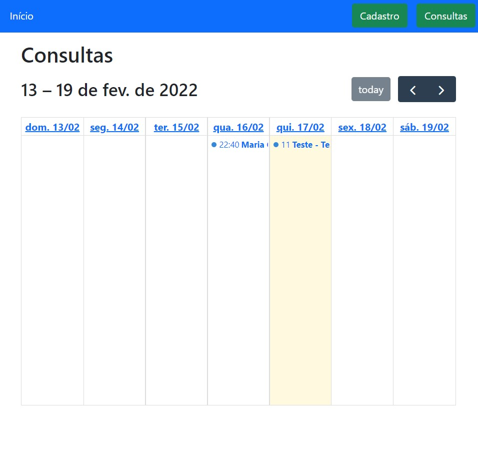
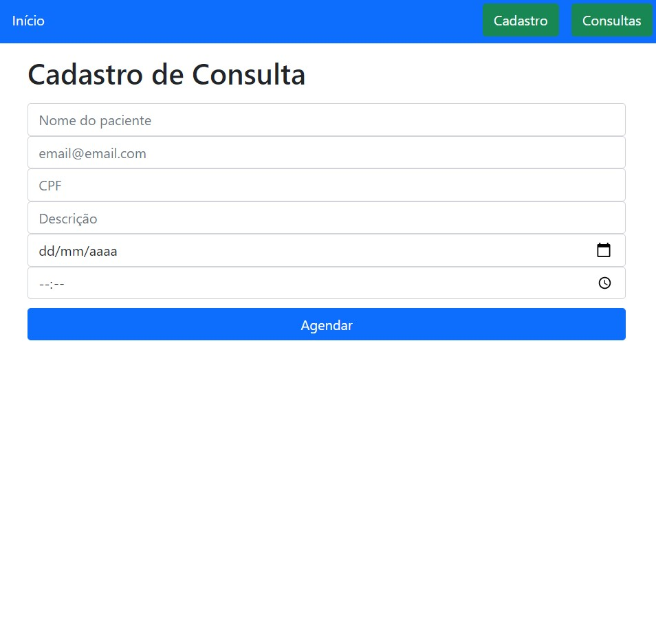
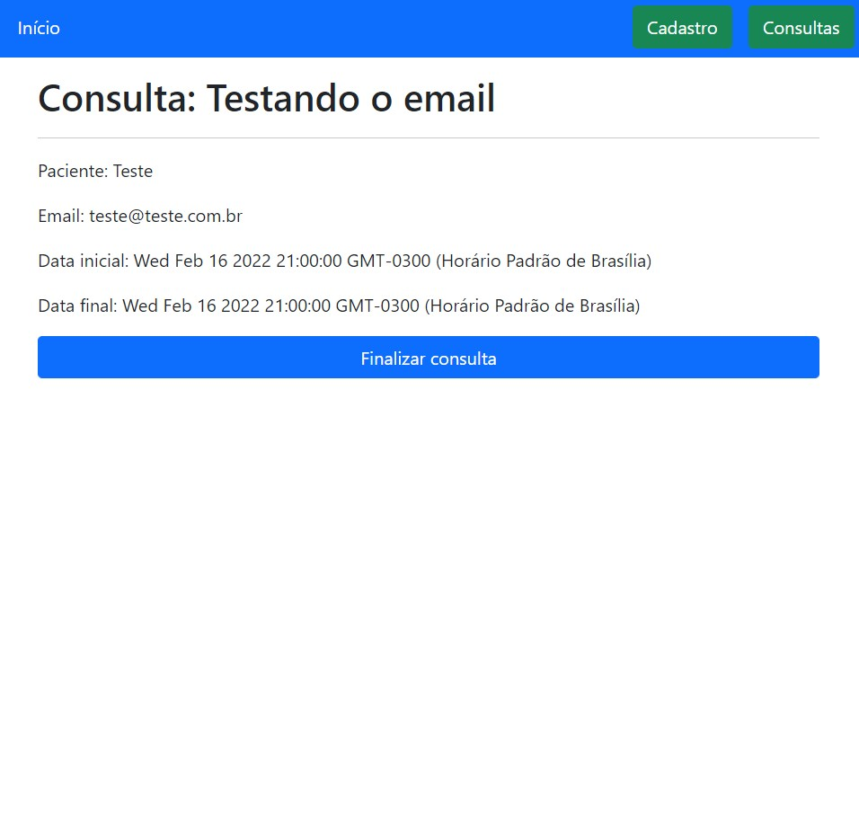
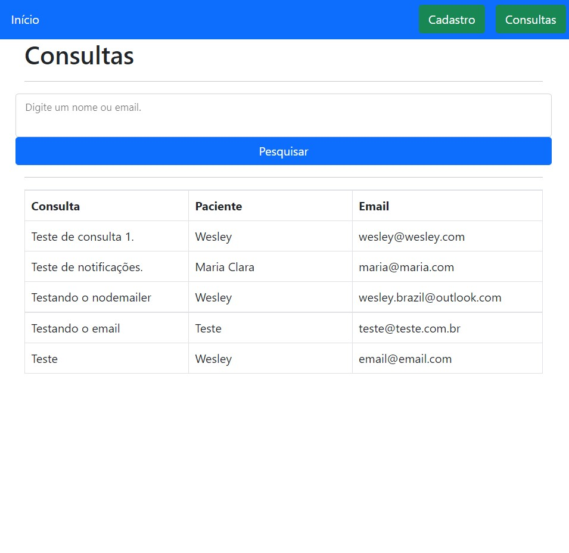

# Agendamento de Consultas

Sistema de agendamento de consultas com notificação por e-mail desenvolvido em NodeJS, Express, MongoDB e Bootstrap.

   
  Imagem 1: Projeto

## Como usar

  
Instalação e uso

  <ul>
    <li>Clone o repositório na sua máquina</li>
    <li>Na pasta Service > AppointmentService, no método "SendNotification" na constante "transport" insira as configurações do seu e-mail de testes.</li>
    <li>Depois, no CMD, digite o comando <code>node index</code> para iniciar a aplicação na rota <code>localhost:8080</code> </li>
  </ul>

## Detalhes das páginas

### Home

Consta um calendário desenvolvido com a biblioteca FullCalendar que indica as consultas já cadastradas no banco de dados.

   
  Imagem 2: Página Início

À partir dessa página é possível entrar nas consultas para visualizar detalhes delas e finalizá-las.

### Cadastro

Nela é possível inserir os seguintes dados dos pacientes para cadastrá-los no banco de dados e as suas consultas aparecerem no calendário na página inicial:

- Nome do paciente;
- E-mail;
- CPF;
- Descrição;
- Data da consulta;
- Horário da consulta.

   
  Imagem 3: Página Cadastro

Observação: quando restar 1 hora para o cliente realizar a consulta, ele será notificado por e-email. 

### Detalhes

É possível entrar nesta página clicando na consulta desejada já cadastrada que aparecerá no calendário.

Aqui aparecerá na tela as seguintes informações dos clientes:

- Paciente;
- E-mail;
- Data inicial da consulta;
- Data final da consulta;

Após essas informações aparece o botão "Finalizar consulta". Se clicado, a consulta não aparecerá mais no calendário na tela inicial. 

   
  Imagem 4: Página Detalhes

### Consultas

Nesta página é possível vizualizar todas as consultas disponíveis no banco de dados e pesquisar consultas pelo e-mail ou nome do paciente.

   
  Imagem 5: Página Consultas

### Bibliotecas

- [x] Express
- [x] FullCalendar
- [x] JQuery Mask
- [x] Nodemailer

